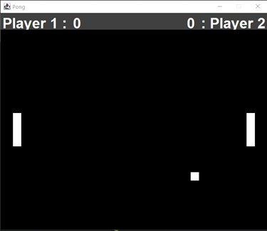

# 1.1 Pong Game Clone Overview

**Overview written by Peter Mitchell.**

## Contents

```
1.1 Pong Game Clone Overview 
1.2 Introduction 
1.3 The Rules of Pong 
1.4 Playing the Game: Controls
1.5 High Level Discussion About Implementation 
1.6 How the Core Game Works
1.7 Implementation of Separate Score Panels 
1.8 Features You Could Add 
```
# 1.2 Introduction

This document will explain the fundamentals of how the Pong game works. 

- ([Youtube Demo](https://youtu.be/b3IgHdTLo8k))

# 1.3 The Rules of Pong

Pong has a very simple set of rules with only a few moving pieces. For the version in this example code,
it will use a score instead of lives. Changing the score to be represent lives is one of the suggested
features to add. The following dot points summarise a simple set of rules for Pong.

- Pong has two players.
- Each player has control of one paddle that can only move up and down.
- A ball will bounce around the screen starting from the middle moving in a random direction.
- The ball hitting the top/bottom wall or either paddle should bounce the ball away from it.
- The ball hitting the wall behind either player’s paddle will award a point to the opposite
    player’s score and start the ball moving randomly from the middle again.

# 1.4 Playing the Game: Controls

The following controls are set up for the game:

- Player 1 on the left can be controlled with W to move up and S to move down.
- Player 2 on the right can be controlled with up arrow to move up and down arrow to move
    down.
- You can also press escape to quit.


# 1.5 High Level Discussion About Implementation

There are three types of classes for developing the implementation of Pong. The first are the lowest
level classes for defining generically reusable tools. The second type are classes for applying the
generic tools to control playing of the game. And finally, the top-level tie everything all together with
the creation of the frame and additional panel. The classes are briefly listed below separated into
these categories.

Generic Tools:

- Position: Defines a single position represented as x,y.
- CollidableRect: Defines a generic rectangle that can be drawn with methods for collisions.

Core Game:

- GamePanel: A panel for the two paddles and ball to move around in.
- Paddle: An extension of the CollidableRect to provide player movement for paddles.
- Ball: An extension of the CollidableRect to make a bouncing ball that responds to collisions.

Additional Top Level:

- Game: To create the JFrame with the GamePanel and ScorePanel and a way for GamePanel to
    pass changes in game state to the ScorePanel.
- ScorePanel: An additional panel to show the current score for both players.



Above you can see a screenshot of the game. You can see the individual elements described. The
paddles on the left and right, the ball in the bottom, and the score panel up the top with the different
coloured background.


# 1.6 How the Core Game Works

This section will focus on the core game classes and how the generic tools were integrated with those.
By using generic implementations of Position and CollidableRect it made the code not necessary to
duplicate between both the Ball and Paddle. It also means it is easy to continue using this code for
future projects. The Position class is used in two separate ways within this program. The first is for
representing positions in terms of an x and y coordinate within the GamePanel. The second is for
representing a movement vector. A movement vector indicates how much an object should move
during each period, by defining how far it should move on the x axis, and y axis. Positive and negative
values then provide direction to move by a magnitude.

The before looking at how the paddles and ball are implemented it is important to look at the
CollidableRect because both Paddle and Ball classes extend from CollidableRect. The CollidableRect
stores a position for the top left corner with a width and height for how far down and across is included
in the rectangle. It also provides definition of a maxX and maxY for keeping objects within the bounds,
and a colour for rendering. The methods that make up the functionality of the class include the
following.

- moveWithinBounds(): Moves the object’s position by an amount defined in a movement
    vector. This is bounded to a minimum and maximum keeping the object inside the defined
    area.
- move(): Is not used, but does the same as moveWithinBounds() without enforcing keeping
    within the bounds.
- isCollidingWith(): Compares the area of the current rectangle with another CollidableRect’s
    rectangle to check for an overlap.
- paint(): Does a simple draw call to draw the rectangle at the defined position with correct size
    and colour.

For the players they will be controlling a Paddle so as a player this is the most important part to start
with. The Paddles extend from a CollidableRect to provide the visual representation, collision logic and
methods for moving. This means that the Paddle can focus on different functionality that is specific to
how the paddle is used by the player. The Paddles have logic to automatically align them to either the
left or right with correct padding and spacing when the constructor is called by passing the data all to
the super() method call for the CollidableRect constructor. When the Paddles are constructed the key
codes for the up and down movement are passed. This means that when each individual Paddle object
is created they can be given unique easily customisable keys. The other two methods that are
necessary for managing the paddle are as follow.

- update(): Will move up or down based on which key/s are currently held. If the up key is held
    down the paddle will move up, if it is held down it will move down. If both are held down it
    will result in it appearing not to move. This is called every time the GamePanel updates.
- processInput(): Checks the keyCode from an input event to see if it matches either of the up
    or down keys defined to control this paddle. If a relevant key state has changed to being
    pressed or released the state of that key is updated so that next time the update() method is
    called it will move or not move based on the key change.


The Ball class is like the Paddle regarding extending from the CollidableRect and having to move
around the game area. Unlike the Paddle though, the Ball class is not player controlled and must
handle this independent movement on its own. Including handling what happens when a collision
occurs with the different surfaces. When a ball is created it is placed in the middle of the playable area
and given a random movement vector to start moving in a direction. The other methods that make up
the functionality of the Ball class include the following.

- update(): Does all the work and calls all the other methods as part of its code. The method
    starts by moving the Ball based on the movement vector. Then checks for collisions against
    the paddles and walls. Hitting the paddles or top/bottom wall make it reflect the movement
    vector. Or hitting the left/right walls calls the applyScoreAndReset() method.
- hitXEdge(): checks if the Ball has hit the left/right wall.
- hitYEdge(): checks if the Ball has hit the top/bottom wall.
- applyScoreAndReset(): Increases the score of the correct player depending on which wall was
    hit, then resets the ball back to the middle and gives it a new random movement vector.
- setRandomMoveVector(): Sets the movement vector to a random vector by randomising both
    the direction and magnitude on both the x and y axis. To ensure the movement is not linear
    on a single axis the random numbers are between 2 and 6 for each magnitude.

The last core class that is part of the main game is the GamePanel class. This ties together the Ball and
a pair of Paddle classes to make them update interactively. The simplicity of this game means that the
definition of the methods in GamePanel are very simple and mostly passing information or instructions
on to the appropriate object/s. The functions that make up the GamePanel include the following.

- update(): Used to call update() in both the left and right paddles, then the ball, and finally
    after all objects have been updated a repaint() is called to redraw based on any changes in
    state. This is called on a timer from the Game object at regular intervals.
- processInput(): Takes in the key code from an input and passes the state of this key event on
    to both the paddles. The paddles individually will determine if it is relevant input for their own
    objects. Additionally, if the escape key is pressed it will cause the program to quit inside this
    method.
- paint(): Calls the paint() methods defined from extending CollidableRect in the left/right
    Paddles and the Ball to draw them all into the panel. This is triggered by the repaint() calls at
    the start of the game and then after every update().
- increaseScore(): Increases the score of the appropriate player and then passes the updated
    score on to the Game object so that it can be communicated to the ScorePanel.


# 1.7 Implementation of Separate Score Panels

The other two classes that have not been discussed yet in this summary are the Game and ScorePanel
classes. Both do play significant roles in making the application work, but regarding the specific game
functionality it is less significant than compared to the other classes that have been discussed in the
previous section.

The Game class is the entry point for creating the Game with a JFrame containing the GamePanel and
ScorePanel. The Game class provides a line of communication from the GamePanel for providing
information about changes in score. It also listens for the events on the keyboard and manages the
update loop on a timer of once every 20ms. The methods defining the functionality for the Game class
that have been utilised include the following.

- startGame(): starts the gameLoopTimer to trigger actionPerformed() events every 20ms.
- setScore(): notifies the ScorePanel of changes in score for a specified player.
- actionPerformed(): is triggered when the timer goes off every 20ms. It then calls the update
    method in GamePanel that will force all the objects to update and then repaint().
- keyPressed(): is triggered when any key is pressed down. It passed the pressed state for the
    key code on to the GamePanel to process.
- keyReleased(): same as keyPressed(), but triggers when any key is released.

ScorePanel is a very simple class in terms of functional code. It is mostly visual with four JLabel objects
positioned within the panel. Two that indicate the player number, and two that indicate the current
score of each player. All of these are configured with an appropriate layout so that the text will appear
over the top where that player’s Paddle will be located. There are only two additional methods that
provide functionality to the ScorePanel.

- setScore(): changes either the left or right score to the new value based on parameters passed
    to the method.
- createLabel(): helps to cut down duplicated code by using one method to apply all similar
    formatting to every label that is created.

You will notice that the information about score is passed through many different classes. Each class
does what it needs to and then passes it on. Updating the score starts in the Ball class during an
update() when a collision occurs with the left or right wall. The GamePanel class is notified which
player should receive a point added to their score. This score is added and stored, then the information
is passed up to the Game object and then back down to the ScorePanel. In the ScorePanel it is then
placed into the appropriate JLabel as new text. By separating out the functionality in this way it
enforces each class having a clear hierarchy and a way to communicate relevant pieces of information
from one side of the hierarchy to the other.


# 1.8 Features You Could Add

Pong as a game is very simple in its basic form. There are many different things you could choose to
add to make it more fun and improve the uniqueness of the game. The following list are just some of
the many things you could change to make the game better.

- Change Score to Lives: Currently there is no way to lose the game. Players will just keep scoring
    forever. You could add lives by changing the score and how it is implemented. Then when the
    number of lives is reduced you could check if they have no lives left causing the other player
    to be announced as the victor.
- Add gradually building difficulty: The ball movement is entirely random currently. You could
    change the ball movement to increase in speed after every time it hits something.
- Add more balls: Currently there is only one ball, but you could try adding more balls and having
    them bounce off each other.
- Add more players: You could add additional players to the top or bottom to increase the
    chaos.
- Allow the paddles to move more than just up and down: With perhaps limited movement you
    could add forward and backward movement to change the point of reflection on the ball.
- Come up with some rule that shrinks or expands the paddles, and/or modifies the speed under
    some set of conditions.
- Add the option of an AI player to the paddles so you can play against the computer.
- Come up with your own new strange rule and try to implement it.


